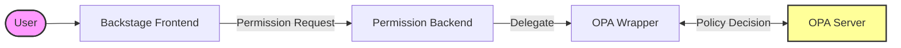
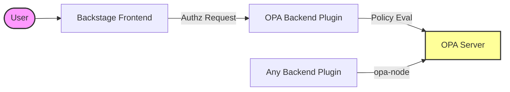

# Welcome to the OPA Plugins Repository for Backstage

[](https://codecov.io/gh/Parsifal-M/backstage-opa-plugins)

This repository contains a collection of plugins for [Backstage](https://backstage.io) that integrate with [Open Policy Agent](https://www.openpolicyagent.org/).

## Blogs

- [Going Backstage with OPA](https://www.styra.com/blog/going-backstage-with-opa/)

## Talks

- [Can It Be Done? Building Fine-Grained Access Control for Backstage with OPA](https://www.youtube.com/watch?v=N0n_czYo_kE&list=PLj6h78yzYM2P4KPyeDFexAVm6ZvfAWMU8&index=15&ab_channel=CNCF%5BCloudNativeComputingFoundation%5D)

## Why use OPA with Backstage?

Integrating Open Policy Agent (OPA) with Backstage allows you to decouple policy from your code. This brings several benefits:

- **Fine-Grained Access Control**: Define complex RBAC and ABAC policies that go beyond standard permission systems.
- **Centralized Policy Management**: Manage policies for Backstage alongside your other infrastructure policies.
- **Dynamic Policy Updates**: Update policies without redeploying your Backstage instance.
- **Consistency**: Ensure consistent policy enforcement across your entire platform.

## Architecture Overview

The plugins integrate with Backstage and OPA in two main ways.

### 1. Permissions Framework Integration

When using the `permission-backend-module-opa-wrapper`, the flow relies on the Backstage Permissions Framework:



### 2. Component Integrations

Other plugins interact with OPA for specific functionality, either by proxying through the backend or checking policies directly from a backend service.



## Prerequisites

To use these plugins, you need:

1.  A running **Backstage** instance.
2.  A running **Open Policy Agent (OPA)** server.

You can deploy OPA in any way that suits your infrastructure (Docker, Kubernetes, Managed Service, etc.). Please refer to the [official OPA deployment documentation](https://www.openpolicyagent.org/docs/latest/deployments/).

## Plugins & Modules

### Backend

- [](https://www.npmjs.com/package/@parsifal-m/plugin-opa-backend) [backstage-opa-backend](./plugins/backstage-opa-backend/README.md) - A Backend Plugin that the `backstage-opa-entity-checker` and `backstage-opa-authz-react` plugins consume to evaluate policies.
- [](https://www.npmjs.com/package/@parsifal-m/plugin-permission-backend-module-opa-wrapper) [permission-backend-module-opa-wrapper](./plugins/permission-backend-module-opa-wrapper/README.md) - A Backstage backend module that integrates Open Policy Agent (OPA) with the Backstage Permission Framework for policy-based authorization.
- [](https://www.npmjs.com/package/@parsifal-m/backstage-plugin-opa-entity-checker-processor) [backstage-plugin-opa-entity-checker-processor](./plugins/backstage-plugin-opa-entity-checker-processor) - A standalone Backstage catalog processor that automatically validates entity metadata during catalog ingestion using OPA policies and adds validation status annotations.

### Frontend

- [](https://www.npmjs.com/package/@parsifal-m/plugin-opa-entity-checker) [backstage-opa-entity-checker](./plugins/backstage-opa-entity-checker/README.md) - A frontend plugin that provides a component card that displays if an entity has the expected entity metadata according to an opa policy.
- [](https://www.npmjs.com/package/@parsifal-m/plugin-opa-policies) [backstage-opa-policies](./plugins/backstage-opa-policies/README.md) - A frontend component designed to be added to entity pages to fetch and display the OPA policy that entity uses based on a URL provided in an annotation in the `catalog-info.yaml` file.
- [](https://www.npmjs.com/package/@parsifal-m/backstage-plugin-opa-authz-react) [backstage-opa-authz-react](./plugins/opa-authz-react/README.md) - A frontend plugin that allows you to control the visibility of components based on the result of an OPA policy evaluation.

### Libraries & Utilities

- [](https://www.npmjs.com/package/@parsifal-m/backstage-plugin-opa-common) [backstage-plugin-opa-common](./plugins/opa-common) - Common types and functionality for the OPA plugins.
- [](https://www.npmjs.com/package/@parsifal-m/backstage-plugin-opa-node) [backstage-plugin-opa-node](./plugins/opa-node) - Provides a Node.js service for integrating Open Policy Agent (OPA) with Backstage backend modules and plugins. It allows you to secure your backend routes using OPA by providing a simple API for sending policy inputs and receiving policy results.

## Configuration Overview

The OPA plugins use two separate configuration sections in your `app-config.yaml`:

### Permission Framework Integration

```yaml
permission:
  opa:
    baseUrl: 'http://localhost:8181'
    policies:
      permissions:
        policyEntryPoint: 'rbac_policy/decision'
        policyFallback: 'allow' # 'allow' or 'deny' (optional)
```

### OPA Backend Services

```yaml
openPolicyAgent:
  baseUrl: 'http://localhost:8181'
  entityChecker:
    enabled: true # Default: false
    policyEntryPoint: 'entity_checker/violation'
  entityCheckerProcessor:
    enabled: true # Default: false
    policyEntryPoint: 'entity_checker/violation'
  policyViewer:
    enabled: true # Default: false
```

> **Important:** All OPA backend features are **disabled by default**. You must explicitly set `enabled: true` for each feature you want to use. This allows selective loading of only the functionality you need.

## Additional Documentation

Each Plugin has its own documentation in the [Plugins](./plugins/) Folder, I am however, slowly moving things to [Github pages](https://parsifal-m.github.io/backstage-opa-plugins/#/). Feel free to help out!

## Local Development

Step by step guide to developing locally:

1. Clone this repository
2. Create an `app-config.local.yaml` file in the root of the repository copying the contents from `app-config.yaml`
3. Create a PAT (Personal Access Token) for your GitHub account with these scopes: `read:org`, `read:user`, `user:email`. This token should be placed under `integrations.github.token` in the `app-config.local.yaml` file.
4. Run `yarn install --immutable` in the root of the repository
5. Use `docker-compose up -d` to start the OPA server and postgres database (this will also load the two policies in the `example-opa-policies` folder automatically)
6. Update the OPA rbac policy in here [rbac_policy.rego](./example-opa-policies/rbac_policy.rego), or use your own! If you want to use the default policy, you'll have to update `is_admin if "group:twocodersbrewing/maintainers" in claims` to what ever your user entity claims are.
7. Run `yarn dev` or `yarn debug` in the root of the repository to start the Backstage app (use debug if you want to see what is happening in the OPA plugin)

## Ecosystem

- [PlaTT Policy Template](https://github.com/ap-communications/platt-policy-template) contains policy templates that will work with the [plugin-permission-backend-module-opa-wrapper](./plugins/permission-backend-module-opa-wrapper/README.md) plugin!

## Contributing

Contributions are welcome! However, still figuring out the best approach as this does require user and group entities to be in the system.

Please open an issue or a pull request. You can also contact me on mastodon at [@parcifal](https://hachyderm.io/@parcifal).

Please remember to sign your commits with `git commit -s` so that your commits are signed!
