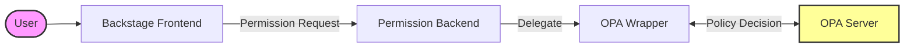
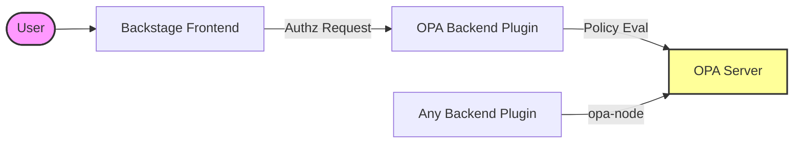

# Backstage OPA Plugins

[](https://codecov.io/gh/Parsifal-M/backstage-opa-plugins)

A Yarn monorepo of [Backstage](https://backstage.io) plugins and modules that integrate [Open Policy Agent (OPA)](https://www.openpolicyagent.org/) with Backstage. Policies live in `.rego` files, are evaluated by a running OPA server, and can be updated without redeploying Backstage.

**Full documentation:** [parsifal-m.github.io/backstage-opa-plugins](https://parsifal-m.github.io/backstage-opa-plugins/)

---

## Why OPA with Backstage?

- **Fine-grained access control** — define complex RBAC and ABAC policies beyond the standard permission system
- **Centralised policy management** — manage Backstage policies alongside your other infrastructure policies
- **Dynamic updates** — update policies without redeploying your Backstage instance
- **Consistency** — enforce policy uniformly across your entire platform

---

## Architecture Overview

### Permissions Framework Integration

When using `permission-backend-module-opa-wrapper`, the Backstage Permission Framework delegates decisions to OPA:


```mermaid
graph LR
    User([User]) --> Frontend[Backstage Frontend]
    Frontend -->|Permission Request| PermBackend[Permission Backend]
    PermBackend -->|Delegate| OPAWrapper[OPA Wrapper]
    OPAWrapper <-->|Policy Decision| OPA[OPA Server]
    style User fill:#f9f,stroke:#333,stroke-width:2px
    style OPA fill:#ff9,stroke:#333,stroke-width:2px
```

### Component Integrations

Other plugins interact with OPA for specific functionality — either proxying through the OPA backend plugin, or calling OPA directly from a backend service:


```mermaid
graph LR
    User([User]) --> Frontend[Backstage Frontend]

    %% Flow 1: Frontend Authz (opa-authz-react)
    Frontend -- "Authz Request" --> OPABackend[OPA Backend Plugin]
    OPABackend -- "Policy Eval" --> OPA[OPA Server]

    %% Flow 2: Backend Node Service (opa-node)
    AnyBackend[Any Backend Plugin] -- "opa-node" --> OPA

    style User fill:#f9f,stroke:#333,stroke-width:2px
    style OPA fill:#ff9,stroke:#333,stroke-width:2px
```

---

## Plugins & Modules

### Backend

| Plugin                                                                                                             | npm                                                                                                                                                                                       | Purpose                                                                                                                                    |
| ------------------------------------------------------------------------------------------------------------------ | ----------------------------------------------------------------------------------------------------------------------------------------------------------------------------------------- | ------------------------------------------------------------------------------------------------------------------------------------------ |
| [backstage-opa-backend](./plugins/backstage-opa-backend/README.md)                                                 | [](https://www.npmjs.com/package/@parsifal-m/plugin-opa-backend)                                                       | HTTP routes used by `opa-authz-react` and `opa-entity-checker` to evaluate OPA policies                                                    |
| [permission-backend-module-opa-wrapper](./plugins/permission-backend-module-opa-wrapper/README.md)                 | [](https://www.npmjs.com/package/@parsifal-m/plugin-permission-backend-module-opa-wrapper)   | Wraps the Backstage Permission Framework — delegates all permission decisions to OPA. Self-registering; no TypeScript policy code required |
| [backstage-plugin-opa-entity-checker-processor](./plugins/backstage-plugin-opa-entity-checker-processor/README.md) | [](https://www.npmjs.com/package/@parsifal-m/backstage-plugin-opa-entity-checker-processor) | Catalog processor that validates entity metadata during ingestion using OPA and adds annotation results                                    |

### Frontend

> **Note:** Frontend authorization components (`opa-authz-react`) have **not yet been migrated to the new Backstage frontend system (NFS)**. They use the legacy frontend system (`createPlugin`, `createApiFactory`). Migration is planned — do not attempt it without updating the skill and docs first.

| Plugin                                                                                                             | npm                                                                                                                                                             | Purpose                                                                                                              |
| ------------------------------------------------------------------------------------------------------------------ | --------------------------------------------------------------------------------------------------------------------------------------------------------------- | -------------------------------------------------------------------------------------------------------------------- |
| [backstage-opa-entity-checker](./plugins/backstage-opa-entity-checker/README.md)                                   | [](https://www.npmjs.com/package/@parsifal-m/plugin-opa-entity-checker)               | Entity page card that shows whether an entity passes an OPA validation policy                                        |
| [backstage-opa-policies](./plugins/backstage-opa-policies/README.md)                                               | [](https://www.npmjs.com/package/@parsifal-m/plugin-opa-policies)                           | Entity page component that fetches and displays the OPA policy associated with an entity via a catalog annotation    |
| [backstage-plugin-opa-authz-react](./plugins/backstage-plugin-opa-authz-react/README.md) ⚠️ Legacy frontend system | [](https://www.npmjs.com/package/@parsifal-m/backstage-plugin-opa-authz-react) | React components (`RequireOpaAuthz`) and hooks (`useOpaAuthz`) for showing/hiding UI elements based on OPA decisions |

### Libraries & Utilities

| Package                                      | npm                                                                                                                                                   | Purpose                                                                                                                                                                              |
| -------------------------------------------- | ----------------------------------------------------------------------------------------------------------------------------------------------------- | ------------------------------------------------------------------------------------------------------------------------------------------------------------------------------------ |
| [opa-node](./plugins/opa-node/README.md)     | [](https://www.npmjs.com/package/@parsifal-m/backstage-plugin-opa-node)     | Backend service (`opaService`) that any backend plugin can inject to call OPA directly for route-level authorization. Self-registering — adding the library dependency is sufficient |
| [opa-common](./plugins/opa-common/README.md) | [](https://www.npmjs.com/package/@parsifal-m/backstage-plugin-opa-common) | Shared TypeScript types used across plugins (`PolicyInput`, `PolicyResult`, etc.)                                                                                                    |

---

## Prerequisites

- A running **Backstage** instance
- A running **OPA** server — see the [OPA deployment documentation](https://www.openpolicyagent.org/docs/latest/deployments/) for Docker, Kubernetes, and managed service options

---

## Configuration Reference

The plugins use **two separate `app-config.yaml` sections** — do not mix them up.

### Permission Framework Integration

Used by `permission-backend-module-opa-wrapper` only:

```yaml
permission:
  enabled: true
  opa:
    baseUrl: 'http://localhost:8181'
    policy:
      policyEntryPoint: 'rbac_policy/decision'
      policyFallbackDecision: 'allow' # 'allow' or 'deny' (optional)
```

### OPA Backend Services

Used by `backstage-opa-backend`, `opa-entity-checker`, and `opa-entity-checker-processor`:

```yaml
openPolicyAgent:
  baseUrl: 'http://localhost:8181'
  entityChecker:
    enabled: true # Default: false
    policyEntryPoint: 'entity_checker/violation'
  entityCheckerProcessor:
    enabled: true # Default: false
    policyEntryPoint: 'entity_checker/violation'
  policyViewer:
    enabled: true # Default: false
```

> **Important:** The `/opa-authz` route (used by `opa-authz-react`) is **always mounted** by `backstage-opa-backend` — no flag required. All other backend features are **disabled by default** and must be explicitly enabled.

---

## Documentation

Full documentation lives at **[parsifal-m.github.io/backstage-opa-plugins](https://parsifal-m.github.io/backstage-opa-plugins/)**, built with Docusaurus from the `opa-docs/` directory in this repo.

Each plugin also has its own `README.md` under `plugins/<plugin-name>/`.

---

## Blogs & Talks

- [Going Backstage with OPA](https://www.styra.com/blog/going-backstage-with-opa/) — Styra blog
- [Can It Be Done? Building Fine-Grained Access Control for Backstage with OPA](https://www.youtube.com/watch?v=N0n_czYo_kE&list=PLj6h78yzYM2P4KPyeDFexAVm6ZvfAWMU8&index=15&ab_channel=CNCF%5BCloudNativeComputingFoundation%5D) — CNCF KubeCon talk

---

## Ecosystem

- [PlaTT Policy Template](https://github.com/ap-communications/platt-policy-template) — policy templates compatible with `plugin-permission-backend-module-opa-wrapper`

---

## Contributing

Contributions are welcome! See [CONTRIBUTING.md](./CONTRIBUTING.md) for local development setup and PR guidelines.

You can also reach out on Mastodon at [@parcifal@hachyderm.io](https://hachyderm.io/@parcifal).
