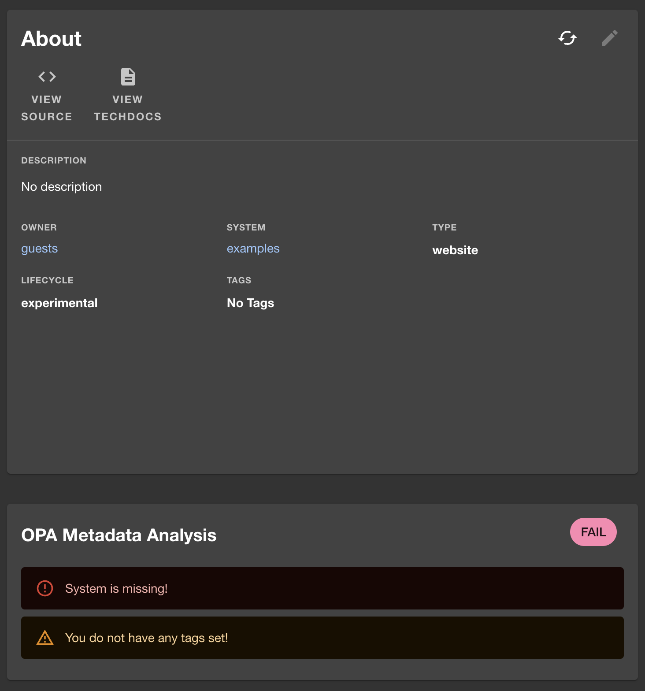

 

# Keep Your Entity Data In Check With OPA Entity Checker

Welcome to a smarter way to ensure data quality! The opa-entity-checker plugin, powered by [OPA](https://github.com/open-policy-agent/opa), offers a straightforward solution to validate your entities against custom policies. It's a great tool for maintaining high data standards in your Backstage instance. And keeps teams on their toes to ensure data quality is always good.

## How It Works

With opa-entity-checker, you can automatically verify if your entities comply with the policies you've set. It displays a clear, concise card on the entity page, indicating the compliance status:

- **Compliant Entities:** A clean card signifies everything is in order.

  

- **Non-Compliant Entities:** A detailed card highlights what needs attention.

  

For more details, check out:

- [Quick-start Guide](/opa-entity-checker/quick-start.md)
- [Local Development Guide](/opa-entity-checker/local-development.md)

## Card Violations Variants

The card comes in two flavor: `default` and `compact`. The version you have seen above is the default card.

The compact version is intended to be used as a banner that display how many errors where found, with a dropdown to
see the details.


## Entity Processor Validation - Validate all entities always

While the frontend validation allows nice feedback for users, only entities that are visited will be validated. After implementing new rules, you might wonder how many entities are now returning validation error.

This is where the catalog processor comes into play. When Backstage discover entities in your repositories it allows plugins called `porcessor` to validate and modify entities. The OPA Entity Checker Catalog Processor will validate your entities whenever they are ingested and add annotation reflecting it's result.

For instance, the final entity in Backstage might look like this:

```yaml
apiVersion: backstage.io/v1alpha1
kind: Component
metadata:
  namespace: default
  annotations:
    open-policy-agent/entity-checker-violations-status: error
```

This means that your validation reported 2 errors and 1 warning. The `status` of the validation is thus `error`. This can be very handy because now we have a way to query the catalogue to find those entities that violate validation.

```http request
GET http://localhost:7007/api/catalog/entities/by-query?filter=metadata.annotations.open-policy-agent/entity-checker-violations-status=error
Content-Type: 'application/json'
Authorization: Bearer {{BACKSTAGE_TOKEN}}
```

## Join The Community

This project is a part of the broader Backstage and Open Policy Agent ecosystems. Explore more about these communities:

- [Backstage Community](https://backstage.io)
- [Open Policy Agent Community](https://www.openpolicyagent.org)
- [Styra](https://www.styra.com)
- [Join OPA on Slack](https://slack.openpolicyagent.org/)
- [Backstage Discord](https://discord.com/invite/MUpMjP2)

## Get Involved

Your contributions can make this plugin even better. Fork the repository, make your changes, and submit a PR! If you have questions or ideas, reach out on [Mastodon](https://hachyderm.io/@parcifal).

## License

This project is licensed under the Apache 2.0 License.
