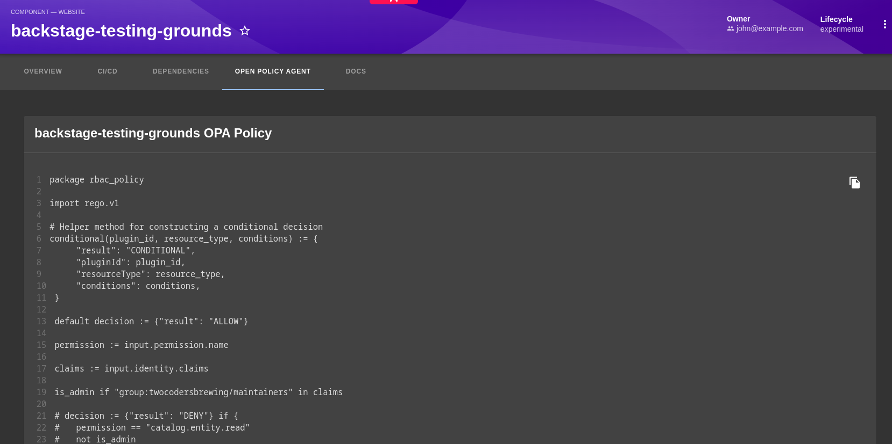

 

# OPA Policies Plugin Overview

The OPA Policies Plugin is designed to enhance visibility and understanding of the policies applied to entities within the Backstage catalog. By fetching and displaying the specific OPA Policy associated with an entity, this plugin makes it straightforward for users to see at a glance which policies are in effect for any given entity.

This functionality is particularly useful for teams looking to maintain compliance and governance standards across their services, as it provides a clear, accessible view of policy application directly on the entity page in Backstage.

To quickly get started with this plugin, follow the steps below.

- [Quick-start Guide](./quick-start.md)

## Community

This project is part of the Backstage and Open Policy Agent communities. For more information, please visit:

- [Backstage](https://backstage.io)
- [Open Policy Agent](https://www.openpolicyagent.org)
- [Styra](https://www.styra.com)
- [OPA Slack](https://slack.openpolicyagent.org/)
- [Backstage Discord](https://discord.com/invite/MUpMjP2)

## Get Involved

Your contributions can make opa-entity-checker even better. Fork the repository, make your changes, and submit a PR. If you have questions or ideas, reach out on [Mastodon](https://hachyderm.io/@parcifal).

## License

This project is licensed under the Apache 2.0 License.
