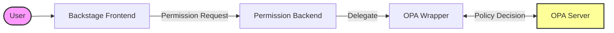
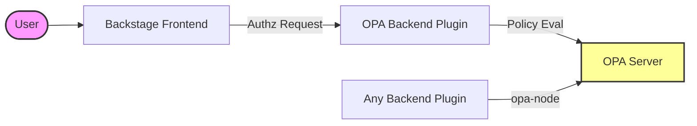

# Welcome to the OPA Plugins Repository for Backstage

This repository contains a collection of plugins for [Backstage](https://backstage.io) that integrate with [Open Policy Agent](https://www.openpolicyagent.org/).

## Blogs

- [Going Backstage with OPA](https://www.styra.com/blog/going-backstage-with-opa/)

## Talks

- [Can It Be Done? Building Fine-Grained Access Control for Backstage with OPA](https://www.youtube.com/watch?v=N0n_czYo_kE&list=PLj6h78yzYM2P4KPyeDFexAVm6ZvfAWMU8&index=15&ab_channel=CNCF%5BCloudNativeComputingFoundation%5D)

## Why use OPA with Backstage?

Integrating Open Policy Agent (OPA) with Backstage allows you to decouple policy from your code. This brings several benefits:

- **Fine-Grained Access Control**: Define complex RBAC and ABAC policies that go beyond standard permission systems.
- **Centralized Policy Management**: Manage policies for Backstage alongside your other infrastructure policies.
- **Dynamic Policy Updates**: Update policies without redeploying your Backstage instance.
- **Consistency**: Ensure consistent policy enforcement across your entire platform.

## Architecture Overview

The plugins integrate with Backstage and OPA in two main ways.

### 1. Permissions Framework Integration

When using the `permission-backend-module-opa-wrapper`, the flow relies on the Backstage Permissions Framework:

### 2. Component Integrations

Other plugins interact with OPA for specific functionality, either by proxying through the backend or checking policies directly from a backend service.

## Prerequisites

To use these plugins, you need:

1.  A running **Backstage** instance.
2.  A running **Open Policy Agent (OPA)** server.

You can deploy OPA in any way that suits your infrastructure (Docker, Kubernetes, Managed Service, etc.). Please refer to the [official OPA deployment documentation](https://www.openpolicyagent.org/docs/latest/deployments/).

## Plugins & Modules

### Backend

- [backstage-opa-backend](opa-backend/introduction.md) - A Backend Plugin that the `backstage-opa-entity-checker` and `backstage-opa-authz-react` plugins consume to evaluate policies.
- [permission-backend-module-opa-wrapper](opa-permissions-wrapper-module/introduction.md) - A Backstage backend module that integrates Open Policy Agent (OPA) with the Backstage Permission Framework for policy-based authorization.
- [backstage-plugin-opa-entity-checker-processor](opa-entity-checker-processor/introduction.md) - A standalone Backstage catalog processor that automatically validates entity metadata during catalog ingestion using OPA policies and adds validation status annotations.

### Frontend

- [backstage-opa-entity-checker](opa-entity-checker/introduction.md) - A frontend plugin that provides a component card that displays if an entity has the expected entity metadata according to an opa policy.
- [backstage-opa-policies](opa-policies/introduction.md) - A frontend component designed to be added to entity pages to fetch and display the OPA policy that entity uses based on a URL provided in an annotation in the `catalog-info.yaml` file.
- [backstage-opa-authz-react](opa-authz-react/introduction.md) - A frontend plugin that allows you to control the visibility of components based on the result of an OPA policy evaluation. This plugin consumes the `backstage-opa-backend` plugin.

### Libraries & Utilities

- [backstage-plugin-opa-common](https://github.com/Parsifal-M/backstage-opa-plugins/tree/main/plugins/opa-common) - Common types and functionality for the OPA plugins.
- [backstage-plugin-opa-node](opa-service/opa-node-service.md) - Provides a Node.js service for integrating Open Policy Agent (OPA) with Backstage backend modules and plugins. It allows you to secure your backend routes using OPA by providing a simple API for sending policy inputs and receiving policy results.

## Contributing

Contributions are welcome! Please open an issue or a pull request. You can also contact me on mastodon at [@parcifal](https://hachyderm.io/@parcifal).

## Ecosystem

- [PlaTT Policy Template](https://github.com/ap-communications/platt-policy-template) contains policy templates that will work with the [plugin-permission-backend-module-opa-wrapper](opa-permissions-wrapper-module/introduction.md) plugin!
