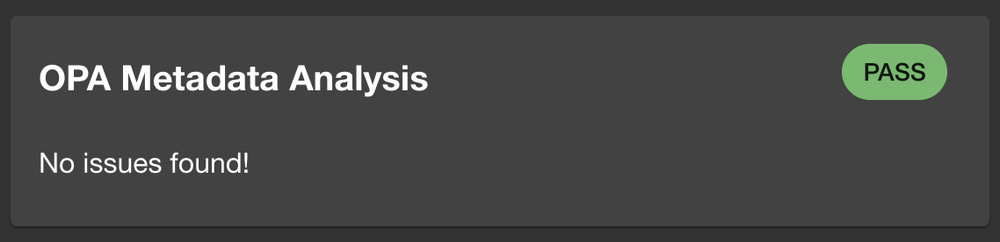
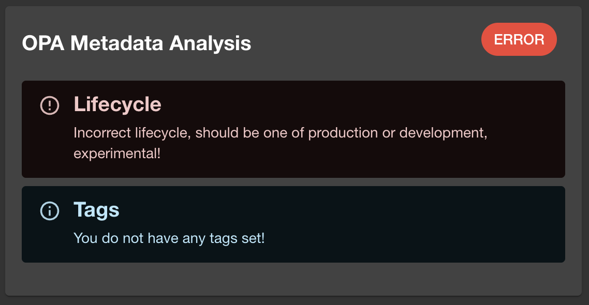
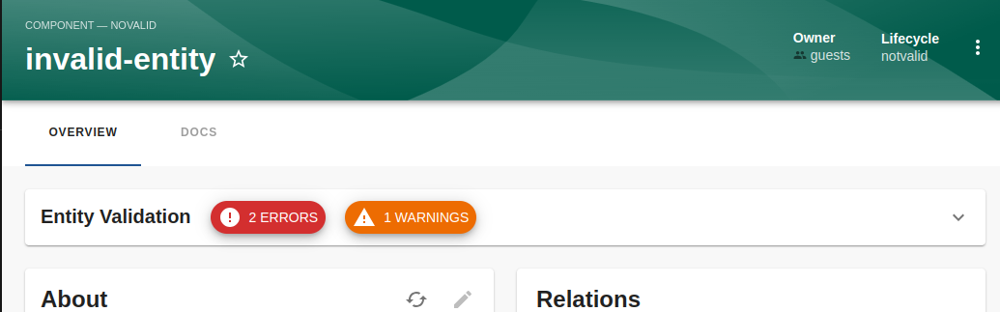
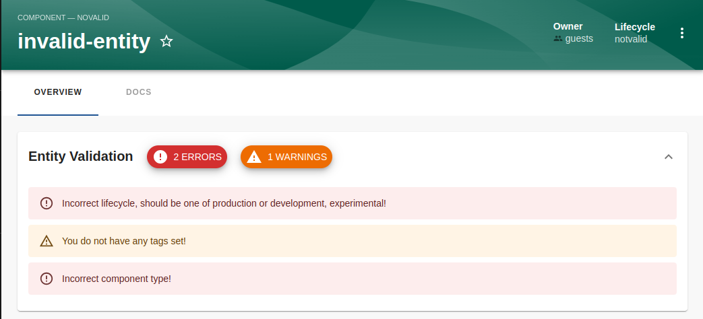

# OPA Entity Checker

Welcome to a smarter way to ensure data quality! The opa-entity-checker plugin, powered by [OPA](https://github.com/open-policy-agent/opa), offers a straightforward solution to validate your entities against custom policies. It's a great tool for maintaining high data standards in your Backstage instance. And keeps teams on their toes to ensure data quality is always good.

## How It Works

With opa-entity-checker, you can automatically verify if your entities comply with the policies you've set. It displays a clear, concise card on the entity page, indicating the compliance status:

- **Compliant Entities:** A clean card signifies everything is in order, if you are using the `compact` version, the card will not be displayed unless there are `info`, `warning` or `error` messages.

  

- **Non-Compliant Entities:** A detailed card highlights what needs attention.

  

For more details, check out:

- [Quick-start Guide](/opa-entity-checker/quick-start.md)
- [Local Development Guide](/opa-entity-checker/local-development.md)

## Card Variants

The card comes in two flavor: `default` and `compact`. The version you have seen above is the default card.

The compact version is intended to be used as a banner that display how many errors where found, with a dropdown to
see the details.





## Entity Processor Validation - Validate all entities always

Imagine this: you've just implemented some new rules, and you're curious to know how many entities might now have issues. While the frontend validation provides quick feedback, it only works when someone visits an entity. But what if you want a broader view?

That's where catalog processors come in! This works behind the scenes when entities are discovered or imported into the Backstage catalog. The OPA Entity Checker Catalog Processor takes it a step further by automatically validating your entities during ingestion. It evaluates them against your policies and adds an annotation to indicate the results.

This means you can stay ahead of potential issues and ensure your catalog remains in top shape—all without lifting a finger!

For instance, the final entity in Backstage might look like this:

```yaml
apiVersion: backstage.io/v1alpha1
kind: Component
metadata:
  namespace: default
  annotations:
    open-policy-agent/entity-checker-validation-status: error
```

As you can see, an annotation of `open-policy-agent/entity-checker-validation-status: error` has been added to the entity, this is because after the processor ran and checked the metadata against the OPA policy it found a violation which is considered an `error`

```http request
GET http://localhost:7007/api/catalog/entities/by-query?filter=metadata.annotations.open-policy-agent/entity-checker-validation-status=error
Content-Type: 'application/json'
Authorization: Bearer {{BACKSTAGE_TOKEN}}
```

## Join The Community

This project is a part of the broader Backstage and Open Policy Agent ecosystems. Explore more about these communities:

- [Backstage Community](https://backstage.io)
- [Open Policy Agent Community](https://www.openpolicyagent.org)
- [Styra](https://www.styra.com)
- [Join OPA on Slack](https://slack.openpolicyagent.org/)
- [Backstage Discord](https://discord.com/invite/MUpMjP2)

## Get Involved

Your contributions can make this plugin even better. Fork the repository, make your changes, and submit a PR! If you have questions or ideas, reach out on [Mastodon](https://hachyderm.io/@parcifal).

## License

This project is licensed under the Apache 2.0 License.
