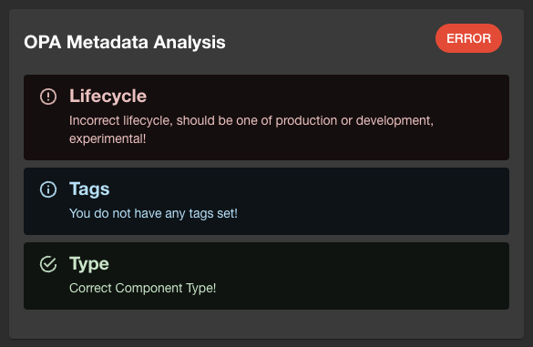

# Quick Start

This guide will help you get started with the OPA Entity Checker module for Backstage.

## Pre-requisites

- You have deployed OPA, kindly see how to do that [here](https://www.openpolicyagent.org/docs/latest/deployments/), or see below.
- You have installed the [OPA Backend Plugin](../opa-backend/introduction.md) in your Backstage instance.

## Deploying OPA

There are many ways to deploy OPA, and there is no one size fits all. A good way is to deploy OPA as a sidecar to your Backstage instance. This way, you can ensure that OPA is always available when your Backstage instance is running.

Here is an example of how you could update your Backstage `k8s` deployment to include OPA, this would be an extension of the `k8s` deployment that you are using for your Backstage instance.

```yaml
#... Backstage deployment configuration with OPA
spec:
  containers:
    - name: backstage
      image: your-backstage-image
      ports:
        - name: http
          containerPort: 7007
    - name: opa
      image: openpolicyagent/opa:0.65.0 # Pin a version of your choice
      ports:
        - name: http
          containerPort: 8181
      args:
        - 'run'
        - '--server'
        - '--log-format=json-pretty'
        - '--set=decision_logs.console=true'
        - '--ignore=.*'
        - '--watch' # Watch for policy changes, this allows updating the policy without restarting OPA
        - '/policies'
      volumeMounts:
        - readOnly: true
          name: opa-policy
          mountPath: /policies
  volumes:
    - name: opa-policy
      configMap:
        name: opa-policy
```

For simplicity you can then create a policy in a `ConfigMap` and mount it into the OPA container.

```yaml
# opa-policy.yaml
apiVersion: v1
kind: ConfigMap
metadata:
  name: opa-policy
data:
  entity_checker.rego: |
    package entity_checker

    import rego.v1

    # By default we assume the entity is bad :)
    default good_entity := false

    # Its a good entity if there are no error violations
    good_entity if {
        count({v | some v in violation; v.level == "error"}) == 0
    }

    # We check if the entity has a system set
    is_system_present if {
        input.spec.system
    }

    # In each rule we check for certain entity metadata and if it is not present we add a violation
    # In this one, we check if the entity has tags set, if it does not we add a warning violation
    violation contains {"check_title": entity_check, "message": msg, "level": "warning"} if {
        not input.metadata.tags
        entity_check := "Tags"
        msg := "You do not have any tags set!"
    }

    # In this example, we check the lifecycle of the entity and if it is not one of the valid ones we add an error violation
    violation contains {"check_title": entity_check, "message": msg, "level": "error"} if {
        valid_lifecycles = {"production", "development", "experimental"}
        not valid_lifecycles[input.spec.lifecycle]
        entity_check := "Lifecycle"
        msg := "Incorrect lifecycle, should be one of production, development, or experimental!"
    }

    # Here we check if the entity has a system set, if it does not we add an error violation
    violation contains {"check_title": entity_check, "message": msg, "level": "error"} if {
        not is_system_present
        entity_check := "System"
        msg := "System is missing!"
    }

    # Lastly here, we check if the entity type is one of the valid ones, if it is not we add an error violation
    violation contains {"check_title": entity_check, "message": msg, "level": "error"} if {
        valid_types = {"website", "library", "service"}
        not valid_types[input.spec.type]
        entity_check := "Type"
        msg := "Incorrect component type!"
    }
```

You can also check the policy in this repository for additional inspiration: [opa-entity-checker](https://github.com/Parsifal-M/backstage-opa-plugins/blob/main/policies/entity_checker.rego).

## Installing The OPA Entity Checker Plugin And The OPA Backend Plugin

Run the following command to install the OPA Entity Checker plugin in your Backstage project.

```bash
yarn add --cwd packages/app @parsifal-m/plugin-opa-entity-checker && yarn add --cwd packages/backend @parsifal-m/plugin-opa-backend
```

Then make the following changes to the `packages/backend/src/index.ts` file in your Backstage project.

```typescript
import { createBackend } from '@backstage/backend-defaults';

const backend = createBackend();
backend.add(import('@backstage/plugin-app-backend/alpha'));
backend.add(import('@backstage/plugin-auth-backend'));
// ..... other plugins
backend.add(import('@parsifal-m/plugin-opa-backend'));
```

## Add The OPA Entity Checker Plugin To Your Frontend

Add the following to your `EntityPage.tsx` file:

```tsx
import {
  OpaMetadataAnalysisCard,
  hasOPAValidationErrors,
} from '@parsifal-m/plugin-opa-entity-checker';

//...

const overviewContent = (
  //...
  <EntitySwitch>
    <EntitySwitch.Case if={hasOPAValidationErrors}>
      <Grid item xs={6}>
        <OpaMetadataAnalysisCard />
      </Grid>
    </EntitySwitch.Case>
  </EntitySwitch>
  //...
);
```

You can also use the compact Card variant as follows. The card is intended to be used as a warning content banner.

```tsx
import {
    OpaMetadataAnalysisCard,
    hasOPAValidationErrors,
} from '@parsifal-m/plugin-opa-entity-checker';

const entityWarningContent = (
    //...
    <EntitySwitch>
      <EntitySwitch.Case if={hasOPAValidationErrors}>
        <Grid item xs={12}>
          <OpaMetadataAnalysisCard
            title="Entity Validation"
            variant="compact"
          />
        </Grid>
      </EntitySwitch.Case>
    </EntitySwitch>
    //...
}
```

Although not mandatory, we recommend using the `<EntitySwitch>` in both the `default` and `compact` versions with `hasOPAValidationErrors` as this will then only display the cards if there are validation errors.

## Additional Props

The `OpaMetadataAnalysisCard` component accepts the following props:

- `title`: The title of the card. Defaults to `OPA Entity Checker`.
- `variant`: The variant of the card. Can be `default` or `compact`. Defaults to `default`.
- `showCheckTitle`: Whether to show the check title. Defaults to `false`.
- `showUrls`: If you return a URL in your OPA policy, you can set this to `true` and clicking on the check title will open the URL in a new tab. Defaults to `false`.

e.g.

```rego
check contains {
    "check_title": "Tags",
    "message": "You do not have any tags set!",
    "level": "info",
    "url": "https://docs.gitlab.com/user/project/repository/tags/"
} if {
    not input.metadata.tags
}
```

This will result in the check card looking like the below, clicking on the check title will open the URL in a new tab.



## Configuration

The OPA client requires configuration to connect to the OPA server. You need to provide a `baseUrl` and an `entrypoint` for the OPA server in your Backstage app-config.yaml, based on the example above we would have the following configuration:

```yaml
opaClient:
  baseUrl: 'http://localhost:8181'
  policies:
    entityChecker: # Entity checker plugin
      entrypoint: 'entity_checker/violation'
```

## Adding the Entity Processor

Run the following command to install the OPA Entity Checker Processor in your Backstage project.

```bash
yarn add --cwd packages/backend @parsifal-m/backstage-plugin-opa-entity-checker-processor
```

Then make the following changes to the `packages/backend/src/index.ts` file in your Backstage project.

```typescript
import { createBackend } from '@backstage/backend-defaults';

const backend = createBackend();
backend.add(import('@backstage/plugin-app-backend/alpha'));
backend.add(import('@backstage/plugin-auth-backend'));
// ..... other plugins
backend.add(import('@parsifal-m/plugin-opa-backend'));
backend.add(
  import('@parsifal-m/backstage-plugin-opa-entity-checker-processor'),
);
```

## Recommendations

I recommend using [Regal: A linter and language server for Rego](https://github.com/StyraInc/regal) to help you write your policies. It provides syntax highlighting, linting, and type checking for Rego files.
