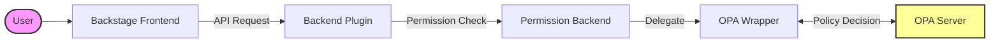
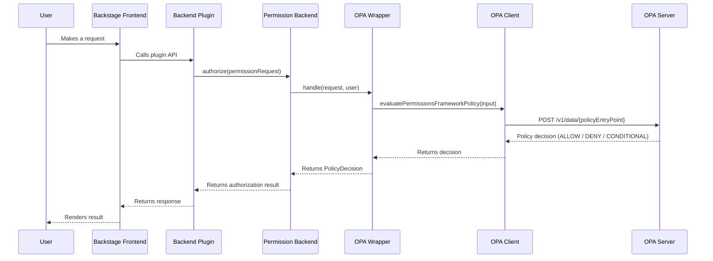

# Open Policy Agent (OPA) Plugins Architecture

This document describes the high-level flow of interactions and the sequence diagram of the plugin interactions in the OPA plugins architecture.

## High-Level Flow of Interactions

```mermaid
graph LR
    User([User]) --> Frontend[Backstage Frontend]
    Frontend -->|API Request| BackendPlugin[Backend Plugin]
    BackendPlugin -->|Permission Check| PermBackend[Permission Backend]
    PermBackend -->|Delegate| OPAWrapper[OPA Wrapper]
    OPAWrapper <-->|Policy Decision| OPA[OPA Server]
    style User fill:#f9f,stroke:#333,stroke-width:2px
    style OPA fill:#ff9,stroke:#333,stroke-width:2px
```

## Sequence Diagram of the Plugin Interactions (New Backend)

This flowchart represents the high-level flow of interactions between the different components in the OPA plugins architecture on the new backend system.

```mermaid
sequenceDiagram
    participant User
    participant Frontend as Backstage Frontend
    participant BackendPlugin as Backend Plugin
    participant PermBackend as Permission Backend
    participant OPAWrapper as OPA Wrapper
    participant OPAClient as OPA Client
    participant OPA as OPA Server

    User->>Frontend: Makes a request
    Frontend->>BackendPlugin: Calls plugin API
    BackendPlugin->>PermBackend: authorize(permissionRequest)
    PermBackend->>OPAWrapper: handle(request, user)
    OPAWrapper->>OPAClient: evaluatePermissionsFrameworkPolicy(input)
    OPAClient->>OPA: POST /v1/data/{policyEntryPoint}
    OPA-->>OPAClient: Policy decision (ALLOW / DENY / CONDITIONAL)
    OPAClient-->>OPAWrapper: Returns decision
    OPAWrapper-->>PermBackend: Returns PolicyDecision
    PermBackend-->>BackendPlugin: Returns authorization result
    BackendPlugin-->>Frontend: Returns response
    Frontend-->>User: Renders result
```

## Understanding the Decision Types

It is important to understand that OPA's role differs depending on the type of decision returned.

### ALLOW / DENY

OPA evaluates the policy and returns a direct `ALLOW` or `DENY`. The Permission Backend passes this straight through — in this case OPA effectively has the final say on whether the action is permitted.

### CONDITIONAL

OPA returns a `CONDITIONAL` decision containing a set of conditions (e.g. `IS_ENTITY_OWNER`, `IS_ENTITY_KIND`). In this case OPA does **not** make the final decision — it defines _criteria_ that the Permission Backend then applies against real resources. The Permission Backend evaluates those conditions against each resource using Backstage's built-in resource rules to determine what the user can actually access.

In short: for ALLOW/DENY, OPA decides. For CONDITIONAL, OPA defines the filter and the Permission Backend enforces it.
