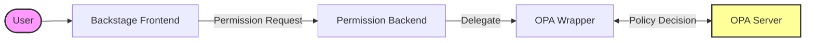

# Open Policy Agent (OPA) Plugins Architecture

This document describes the high-level flow of interactions and the sequence diagram of the plugin interactions in the OPA plugins architecture.

## High-Level Flow of Interactions

## Sequence Diagram of the Plugin Interactions (New Backend)

This flowchart represents the high-level flow of interactions between the different components in the OPA plugins architecture on the new backend system.

