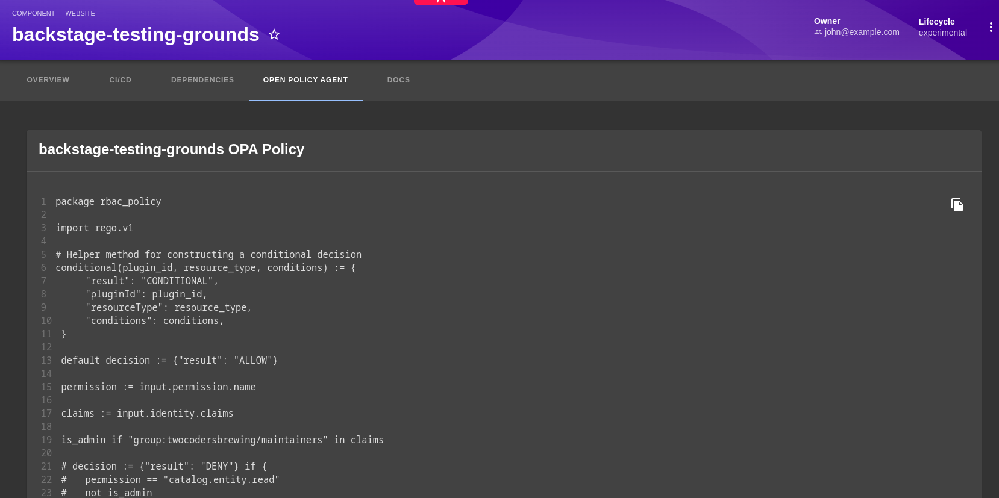

 

# OPA Policies Plugin Overview

The OPA Policies Plugin enhances visibility of the policies applied to entities in the Backstage catalog. By fetching and displaying the OPA policy file associated with an entity, it gives users a clear, syntax-highlighted view of which policies are in effect — directly on the entity page.

This is particularly useful for teams maintaining compliance and governance standards across their services.

## Frontend system support

| Entry point                             | System                  |
| --------------------------------------- | ----------------------- |
| `@parsifal-m/plugin-opa-policies`       | Legacy (old) app        |
| `@parsifal-m/plugin-opa-policies/alpha` | New frontend system app |

Both entry points are published and supported. The `./alpha` entry adds an `EntityContentBlueprint` that wires the OPA Policy tab into the new system automatically — no manual route registration needed.

## Get started

- [Quick-start Guide](./quick-start.md)
- [Local Development](./local-development.md)

## Join The Community

This project is a part of the broader Backstage and Open Policy Agent ecosystems. Explore more about these communities:

- [Backstage Community](https://backstage.io)
- [Open Policy Agent Community](https://www.openpolicyagent.org)
- [Join OPA on Slack](https://slack.openpolicyagent.org/)
- [Backstage Discord](https://discord.com/invite/MUpMjP2)

## Get Involved

Your contributions can make this plugin even better. Fork the repository, make your changes, and submit a PR! If you have questions or ideas, reach out on [Mastodon](https://hachyderm.io/@parcifal).

## License

This project is licensed under the Apache 2.0 License.
