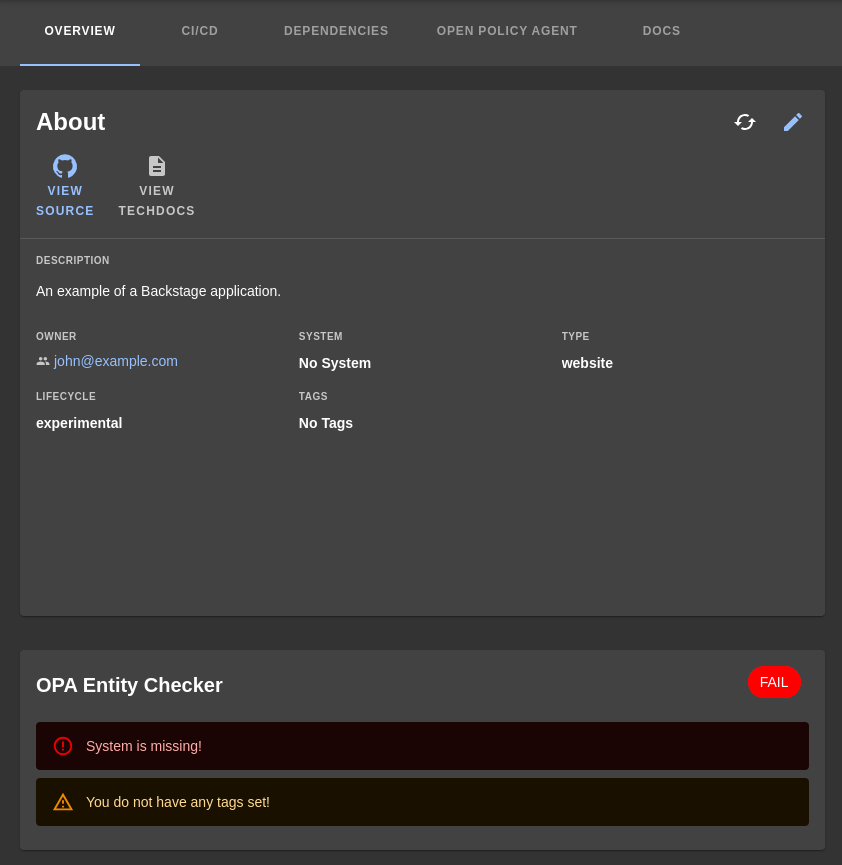
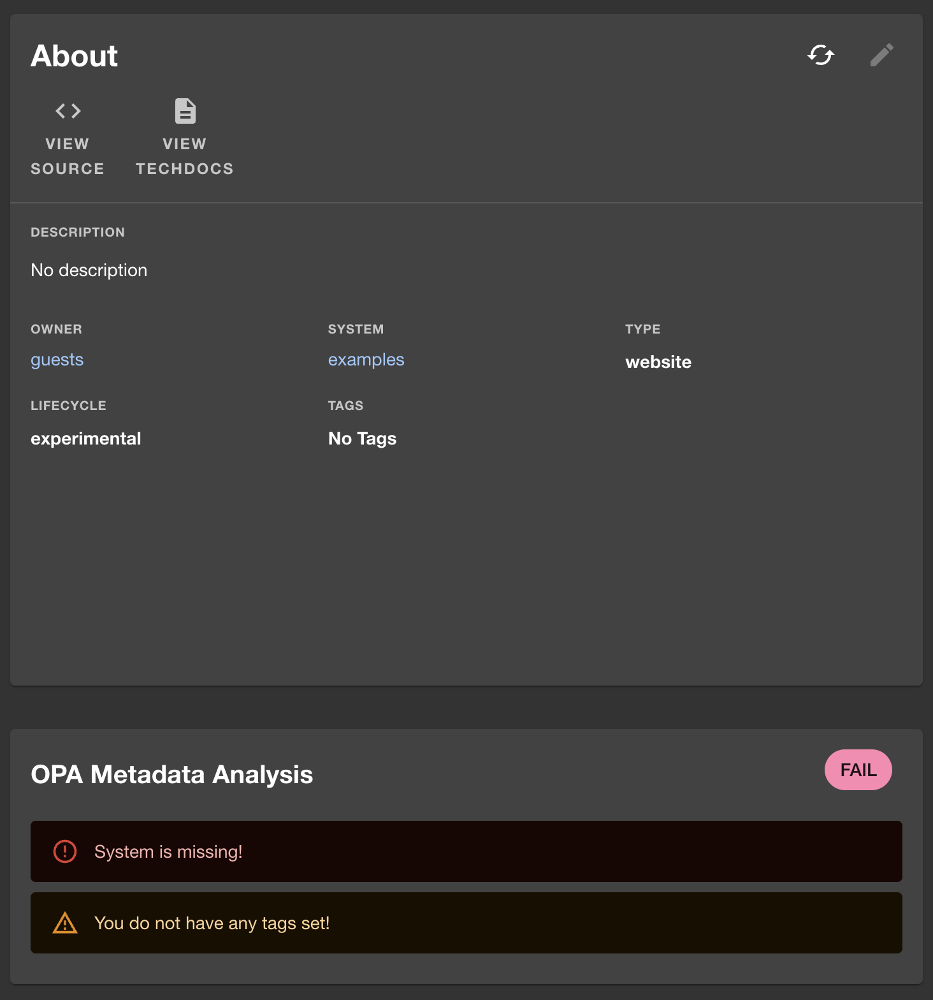

# opa-entity-checker

Welcome to the opa-entity-checker plugin! This plugin uses [OPA](https://github.com/open-policy-agent/opa) to check your entities against a policy you set. It will then display the results of the check on the entity page. This is a good way to remind people of the data quality that is expected in your Backstage instance.



If you need help with OPA, you can find the documentation [here](https://www.openpolicyagent.org/docs/latest/).

## Pre-requisites

To use this plugin, you will first need to install the opa-backend plugin. Which can be found [here](../backstage-opa-backend/README.md).

## Installation

To add this plugin to Backstage, run the following command:

```bash
yarn add @parsifal-m/plugin-opa-entity-checker
```

## What does this do?

This plugin will allow you to run OPA against your entities in Backstage and see if they are compliant with your policies. It will display a card on the entity page with the results of the check which looks like this:



If there are no issues or violations, the card will look like this:


## How do I set the policy?

The policy is set in the `app-config.yaml` file like so:

```yaml
opaClient:
  baseUrl: 'http://localhost:8181'
  policies:
    entityChecker: # Entity checker plugin
      entrypoint: 'entity_checker/violation'
```

Then in your OPA Policy (the `rego` file) you can use the following to set any violations you want to display (you do not have to use violation, you can use any rule head you want, but you will need to change the `entrypoint` in the `app-config.yaml` file to match the rule head you use):

```rego
package entity_checker

import future.keywords.contains
import future.keywords.if
import future.keywords.in

default good_entity := false

good_entity if {
	count({v | some v in violation; v.level == "error"}) == 0
}

violation contains {"check_title": entity_check, "message": msg, "level": "warning"} if {
	not input.metadata.tags
	entity_check := "Tags"
	msg := "You do not have any tags set!"
}

violation contains {"check_title": entity_check, "message": msg, "level": "error"} if {
	valid_lifecycles = {"production", "development"}
	not valid_lifecycles[input.spec.lifecycle]
	entity_check := "Lifecycle"
	msg := "Incorrect lifecycle, should be one of production or development"
}

violation contains {"check_title": entity_check, "message": msg, "level": "error"} if {
	not is_system_present
	entity_check := "System"
	msg := "System is missing!"
}

violation contains {"check_title": entity_check, "message": msg, "level": "error"} if {
	valid_types = {"website", "library", "service"}
	not valid_types[input.spec.type]
	entity_check := "Type"
	msg := "Incorrect component type!"
}

is_system_present if {
	input.spec.system
}
```

## Add the card to your entity page

Add the following to your `EntityPage.tsx` file:

```tsx
import { OpaMetadataAnalysisCard } from '@parsifal-m/plugin-opa-entity-checker';

//...

const overviewContent = (
  //...
  <Grid item md={6} xs={12}>
    <OpaMetadataAnalysisCard />
  </Grid>
  //...
);
```

## Contributing

I am happy to accept contributions to this plugin. Please fork the repository and open a PR with your changes. If you have any questions, please feel free to reach out to me on [Mastodon](https://hachyderm.io/@parcifal) or [Twitter](https://twitter.com/_PeterM_) (I am not as active on Twitter)

## License

This project is released under the Apache 2.0 License.
