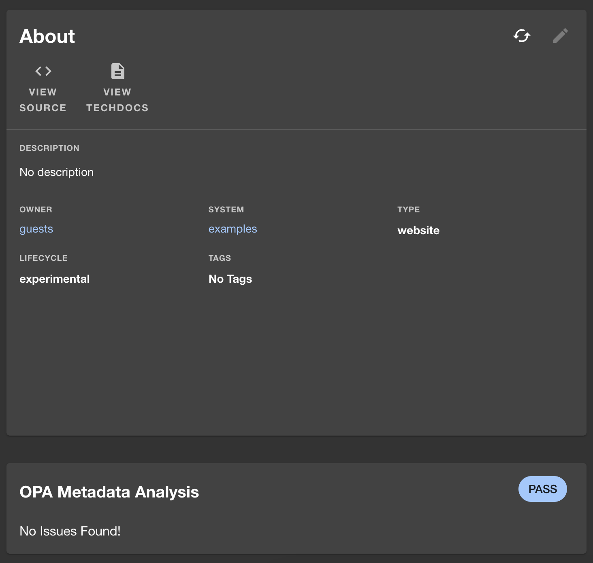

# opa-entity-checker

Welcome to the opa-entity-checker plugin! This plugin uses [OPA](https://github.com/open-policy-agent/opa) to check your entities against a policy you set. It will then display the results of the check on the entity page. This is a good way to remind people of the data quality that is expected in your Backstage instance.

If you need help with OPA, you can find the documentation [here](https://www.openpolicyagent.org/docs/latest/).

## Pre-requisites

To use this plugin, you will first need to install the opa-backend plugin. Which can be found [here](https://github.com/Parsifal-M/backstage-opa-backend#opa-backend)

## Installation

To add this plugin to Backstage, run the following command:

```bash
yarn add @parsifal-m/plugin-opa-entity-checker
```

## What does this do?

This plugin will allow you to run OPA against your entities in Backstage and see if they are compliant with your policies. It will display a card on the entity page with the results of the check which looks like this:


If there are no issues or violations, the card will look like this:



## How do I set the policy?

The policy is set in the `app-config.yaml` file like so:

```yaml
opaClient:
  baseUrl: "http://localhost:8181"
  policies:
    entityChecker: # Entity checker plugin
      package: "entity_checker"
```

Then in your OPA Policy (the `rego` file) you can use the following to set any violations you want to display:

```rego
package your-package-name

default allow = false

allow {
	count({v | v := violation[_]; v.level == "error"}) == 0
}

violation[{"message": msg, "level": "warning"}] {
    not input.metadata.tags
    msg := "You do not have any tags set!"
}

violation[{"message": msg, "level": "error"}] {
	valid_lifecycles = {"production", "development", "experimental"}
    not valid_lifecycles[input.spec.lifecycle]
    msg := "Incorrect lifecycle, should be one of production, development or experimental"
}

violation[{"message": msg, "level": "error"}] {
    not is_system_present
    msg := "System is missing!"
}

violation[{"message": msg, "level": "error"}] {
	valid_types = {"website", "library", "service"}
    not valid_types[input.spec.type]
	not valid_types
    msg := "Incorrect component type!"
}

is_system_present {
	input.spec.system
}
```

## Add the card to your entity page

Add the following to your `EntityPage.tsx` file:

```tsx
import { OpaMetadataAnalysisCard } from "@parsifal-m/plugin-opa-entity-checker";

//...

const overviewContent = (
  //...
  <Grid item md={6} xs={12}>
    <OpaMetadataAnalysisCard />
  </Grid>
  //...
);
```

You can also find the example policy [here](policy/example_policy.rego)

## Contributing

I am happy to accept contributions to this plugin. Please fork the repository and open a PR with your changes. If you have any questions, please feel free to reach out to me on [Mastodon](https://hachyderm.io/@parcifal) or [Twitter](https://twitter.com/_PeterM_) (I am not as active on Twitter)

## License

This project is released under the Apache 2.0 License.