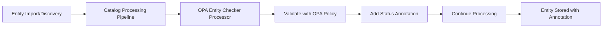

# OPA Entity Checker Processor

A standalone Backstage catalog processor that automatically validates entity metadata during catalog ingestion using Open Policy Agent (OPA) policies. The processor adds validation status annotations to entities without blocking catalog operations.

## Overview

The OPA Entity Checker Processor integrates directly into Backstage's catalog processing pipeline to:

- **Validate all entities** automatically during catalog ingestion
- **Annotate entities** with validation results (`success`, `warning`, or `error`)
- **Enable API-driven queries** for entities by validation status
- **Maintain catalog performance** with non-blocking, asynchronous validation

Unlike frontend-only validation, this processor ensures consistent validation across all catalog operations and provides queryable results for building governance dashboards and automated workflows.

> **Note**: The processor automatically skips validation for `location` and `user` entities as they are typically managed by external providers.

## Key Features

### 🔄 Automatic Validation

Validates entities during discovery, import, and update operations without manual intervention.

### 🏷️ Status Annotations

Adds standardized annotations to entities based on validation results:

```yaml
metadata:
  annotations:
    open-policy-agent/entity-checker-validation-status: "error" | "warning" | "info" | "pass"
```

### 🔍 API Queryable

Query entities by validation status using Backstage's catalog API:

```bash
# Find all entities with validation errors
GET /api/catalog/entities/by-query?filter=metadata.annotations.open-policy-agent/entity-checker-validation-status=error

# Find all entities that passed validation
GET /api/catalog/entities/by-query?filter=metadata.annotations.open-policy-agent/entity-checker-validation-status=pass
```

### 🚀 Performance Optimized

- Non-blocking validation that doesn't prevent entity ingestion
- Asynchronous processing for optimal catalog performance
- Configurable enablement for environment-specific needs

### 🔧 Standalone Design

Completely independent module that can be used without other OPA plugins. Minimal dependencies and flexible deployment options.

## Quick Start

### 1. Install

```bash
yarn add --cwd packages/backend @parsifal-m/backstage-plugin-opa-entity-checker-processor
```

### 2. Register Module

Add to your `packages/backend/src/index.ts`:

```typescript
backend.add(
  import('@parsifal-m/backstage-plugin-opa-entity-checker-processor'),
);
```

### 3. Configure

Add to your `app-config.yaml`:

```yaml
openPolicyAgent:
  baseUrl: 'http://localhost:8181'
  entityCheckerProcessor:
    enabled: true
    policyEntryPoint: 'entity_checker/violation'
```

### 4. Create Policy

Example Rego policy for entity validation:

```rego
package entity_checker

import rego.v1

# Entity is valid if no error-level violations
default good_entity := false
good_entity if {
    count({v | some v in violation; v.level == "error"}) == 0
}

# Require owner for all components
violation contains {
    "check_title": "Owner Required",
    "message": "All components must have an owner",
    "level": "error"
} if {
    input.kind == "Component"
    not input.spec.owner
}
```

## Architecture



The processor integrates seamlessly into Backstage's catalog processing pipeline, validating entities and adding annotations without disrupting the standard catalog workflow.

## Use Cases

### Governance and Compliance

Automatically ensure all entities meet organizational standards for ownership, documentation, and metadata completeness.

### Security Validation

Validate that production entities have required security reviews, compliance annotations, or approval workflows.

### API-Driven Workflows

Build dashboards, reports, and automated workflows using validation status annotations through Backstage's catalog API.

### Team Accountability

Query entities by team ownership and validation status to identify areas needing attention or improvement.

## Configuration Reference

| Setting                                   | Type    | Default                 | Description              |
| ----------------------------------------- | ------- | ----------------------- | ------------------------ |
| `baseUrl`                                 | string  | `http://localhost:8181` | OPA server URL           |
| `entityCheckerProcessor.enabled`          | boolean | `false`                 | Enable/disable processor |
| `entityCheckerProcessor.policyEntryPoint` | string  | required                | OPA policy path          |

> **Note**: The processor is disabled by default. Set `enabled: true` to activate validation.

## Why Annotations Instead of Errors?

Using annotations instead of processing errors provides several advantages:

- **Non-blocking**: Entities with validation issues still get processed into the catalog
- **Flexible handling**: Teams can decide how to respond to warnings vs. errors
- **API integration**: Validation status becomes queryable metadata
- **Progressive improvement**: Allows gradual adoption without breaking existing workflows

> Backstage doesn't currently support custom status types, making annotations the most effective approach for validation metadata.

## Documentation

For comprehensive documentation, setup guides, and examples:

- 📖 **[Introduction](../../opa-docs/docs/opa-entity-checker-processor/introduction.md)** - Detailed overview and architecture
- 🚀 **[Quick Start Guide](../../opa-docs/docs/opa-entity-checker-processor/quick-start.md)** - Complete installation and configuration
- 📝 **[Policy Examples](../../opa-docs/docs/opa-entity-checker-processor/policy-examples.md)** - Common validation patterns
- 🔧 **[Integration Guide](../../opa-docs/docs/opa-entity-checker-processor/integration.md)** - Using validation results in applications

## Future Enhancements

- [ ] **Notification Integration**: Automatically notify entity owners of validation issues
- [ ] **Analytics Dashboard**: Built-in component for viewing validation metrics by team/system
- [ ] **Validation History**: Track validation status changes over time
- [ ] **Policy Testing**: Built-in tools for testing policies against sample entities

## Contributing

We welcome contributions! Please see the [Contributing Guide](../../CONTRIBUTING.md) for details on:

- Reporting issues
- Submitting feature requests
- Development setup
- Code standards

## License

This project is licensed under the Apache 2.0 License - see the [LICENSE](LICENSE.md) file for details.
